# Zeit- und Wetter-Widgets für vis-2

Die Zeit- und Wetter-Widgets sind sieben Widgets für Uhren, Datum und Wetter. Diese Seite beschreibt die Version für
**vis-2**. vis (vis-1) hat dieselben Widgets mit denselben Einstellungen, dort sehen sie aber etwas anders aus.

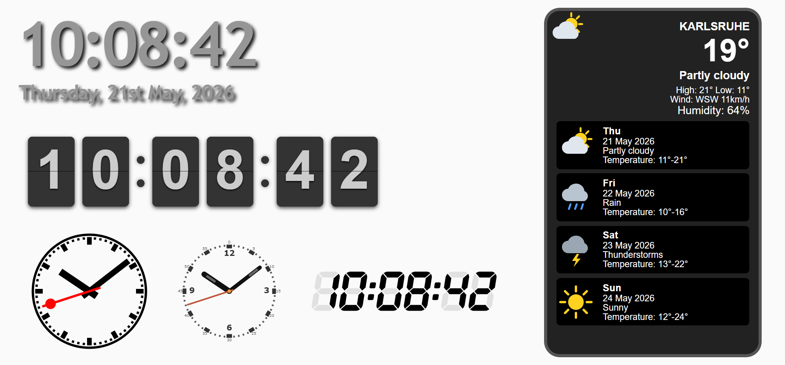

**Inhalt**

- [Allgemeines](#allgemeines)
    - [Voraussetzungen und Migration](#voraussetzungen-und-migration)
    - [Sprache](#sprache)
    - [Eigenes CSS](#eigenes-css)
    - [Dunkles Design](#dunkles-design)
- [Einfache Uhr](#einfache-uhr---tpltwsimpleclock)
- [Einfaches Datum](#einfaches-datum---tpltwsimpledate)
- [Cool-Uhr](#cool-uhr---tpltwcoolclock)
- [Klappzahluhr](#klappzahluhr---tpltwflipclock)
- [Wetter (eigene Daten)](#wetter-eigene-daten---tpltwweather)
- [SVG-Uhr](#svg-uhr---tplsvgclock)
- [Segmentanzeige](#segmentanzeige---tplsegmentclock)
- [Unterschiede zu vis-1](#unterschiede-zu-vis-1)

## Allgemeines

### Voraussetzungen und Migration

Die Widgets stehen im vis-2-Editor in der Widget-Liste unter dem Satz **Zeit und Wetter**. Die hier beschriebenen
React-Versionen brauchen **vis-2 2.12.8** oder neuer. Ältere vis-2-Versionen zeigen stattdessen die vis-1-Widgets.

Projekte aus vis-1 funktionieren ohne Änderungen weiter. Beide Versionen verwenden dieselben Widget-IDs
(`tplTwSimpleClock`, `tplTwCoolClock`, ...) und dieselben Attributnamen, und vis-2 nimmt automatisch die
React-Version. Alle Einstellungen bleiben erhalten.

In den Tabellen unten ist **Einstellung** die Bezeichnung im vis-2-Editor und **Attribut** der Name, unter dem der
Wert im Projekt gespeichert wird. Den Attributnamen braucht man, wenn man ein Projekt als JSON bearbeitet oder
Einstellungen zwischen Widgets kopiert.

Die Uhren zeigen die Zeit des Geräts, auf dem die View angezeigt wird, nicht die Zeit des ioBroker-Servers. Alle
Uhren schalten im selben Moment, zur vollen Sekunde.

### Sprache

Wochentage, Monatsnamen und die Wörter des Wetter-Widgets gibt es in allen Sprachen von vis-2: Englisch, Deutsch,
Russisch, Portugiesisch, Niederländisch, Französisch, Italienisch, Spanisch, Polnisch, Ukrainisch und Chinesisch. Die
Widgets verwenden die Sprache von vis-2. Das Wetter-Widget hat eine eigene Einstellung, um sie zu überschreiben.

### Eigenes CSS

Die Widgets verwenden die Klassennamen von vis-1, und die Regeln haben dasselbe Gewicht wie dort. CSS, das man für
vis-1 im CSS des Projekts geschrieben hat, greift deshalb weiterhin, zum Beispiel:

```css
/* grauer Hintergrund für die Vorhersagetage */
.weatherForecastItem { background-color: #444; }
/* rote Ziffern der Klappzahluhr */
.flip-clock-wrapper ul li a div div.inn { color: #e53935; }
```

| Widget | Klassen |
|---|---|
| Einfache Uhr | `clock` am Widget |
| Einfaches Datum | `date` am Widget |
| Klappzahluhr | `flip-clock-wrapper`, `flip`, `play`, `flip-clock-before`, `flip-clock-active`, `up`, `down`, `inn`, `shadow`, `flip-clock-divider`, `flip-clock-dot`, `flip-clock-meridium` |
| Wetter (eigene Daten) | `weatherFeed` am Widget, `weatherItem` (dazu `day` oder `night`), `weatherCity`, `weatherTemp`, `weatherDesc`, `weatherRange`, `weatherWind`, `weatherHumidity`, `weatherForecast`, `weatherForecastItem`, `weatherForecastDay`, `weatherForecastDate`, `weatherForecastText`, `weatherForecastRange` |

Die CSS-Einstellungen eines Widgets im Editor (Schrift, Farbe, Rahmen, ...) gelten für das Widget selbst. Sie haben
Vorrang vor `clock`, `date` und `weatherFeed`, die am Widget sitzen. Die inneren Teile der Klappzahluhr und der
Wetterbox behalten ihre eigenen Farben; diese ändert man mit Regeln wie oben. Die Schriftgröße des Wetter-Widgets
skaliert die ganze Box. Die Farben der SVG-Uhr, der Cool-Uhr und der Segmentanzeige sind Einstellungen der Widgets.

### Dunkles Design

Die Zifferblätter der Uhren und die Wetterbox behalten ihre Farben in beiden Designs von vis-2. Nur was direkt auf
der View liegt, ändert sich: die Punkte und AM/PM der Klappzahluhr. Siehe [Klappzahluhr](#klappzahluhr---tpltwflipclock).

## Einfache Uhr - `tplTwSimpleClock`

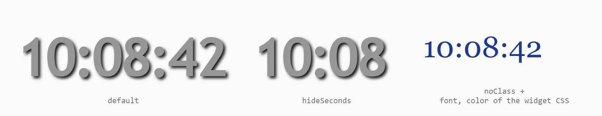

Die Uhrzeit als Text: `hh:mm:ss` oder `hh:mm`, immer im 24-Stunden-Format mit führenden Nullen. Das Bild zeigt die
Standardeinstellung, die Uhr ohne Sekunden und eine Uhr mit *Kein Stil* und eigener Schrift und Farbe.

**Aussehen.** Das Widget bekommt die Klasse `clock`: große, graue, fette Ziffern mit Schatten (Trebuchet MS, 80 px).
Die CSS-Einstellungen des Widgets im Editor überschreiben einzelne Eigenschaften davon, zum Beispiel nur die
Schriftgröße. Wer die Uhr vollständig mit einer eigenen Klasse gestalten will, schaltet *Kein Stil* ein: Dann hat das
Widget kein eigenes Aussehen mehr.

| Einstellung | Attribut | Standard | Beschreibung |
|---|---|---|---|
| Keine Sekunden zeigen | `hideSeconds` | aus | Zeigt `hh:mm`. |
| Blinken | `blink` | aus | Nur ohne Sekunden: Der Doppelpunkt verschwindet jede zweite Sekunde. Die Minuten verrutschen dabei nicht. |
| Kein Stil | `noClass` | aus | Entfernt die Klasse `clock`, siehe oben. |

Standardgröße: 316 x 92 px.

## Einfaches Datum - `tplTwSimpleDate`

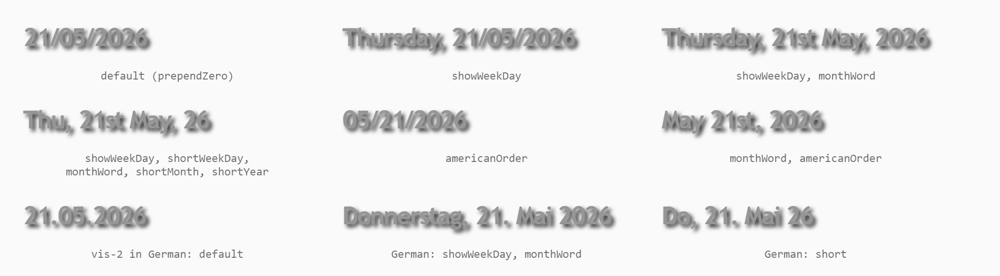

Das heutige Datum als Text. Es wechselt direkt nach Mitternacht.

| Einstellung | Attribut | Standard | Beschreibung |
|---|---|---|---|
| Wochentag zeigen | `showWeekDay` | aus | Stellt den Wochentag voran: `Donnerstag, ...`. |
| Kurzer Wochentag | `shortWeekDay` | aus | Nur mit *Wochentag zeigen*: `Do`, `Thu`, ... |
| Kurzes Jahr | `shortYear` | aus | `26` statt `2026`. |
| Führende Null | `prependZero` | an | `05` statt `5` für Tag und Monat. |
| Monat als Text | `monthWord` | aus | `21. Mai 2026` statt Zahlen. |
| Kurzer Monat | `shortMonth` | aus | Nur mit *Monat als Text*: die ersten drei Buchstaben, z. B. `Sep`. |
| US-Format | `americanOrder` | aus | Nur Englisch: Monat vor Tag. |
| Kein Stil | `noClass` | aus | Entfernt die Klasse `date` (grauer fetter Text, 26 px), wie *Kein Stil* der [Einfachen Uhr](#einfache-uhr---tpltwsimpleclock). |

Die Formate hängen von der Sprache von vis-2 ab:

| | Englisch | US-Format (Englisch) | Alle anderen Sprachen |
|---|---|---|---|
| Zahlen | `21/05/2026` | `05/21/2026` | `21.05.2026` |
| Monat als Text | `21st May, 2026` | `May 21st, 2026` | `21. Mai 2026` |

Standardgröße: 134 x 33 px. Längere Texte, zum Beispiel mit Wochentag, brechen in eine zweite Zeile um, wenn das
Widget nicht breit genug ist.

## Cool-Uhr - `tplTwCoolClock`

Eine Analoguhr mit 21 Designs, auf ein Canvas gezeichnet. Die Uhr ist immer rund. Ihr Durchmesser ist die kürzere
Seite des Widgets, und der Editor hält das Widget quadratisch.

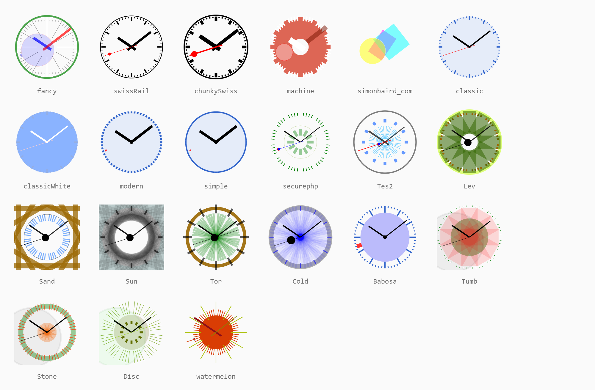

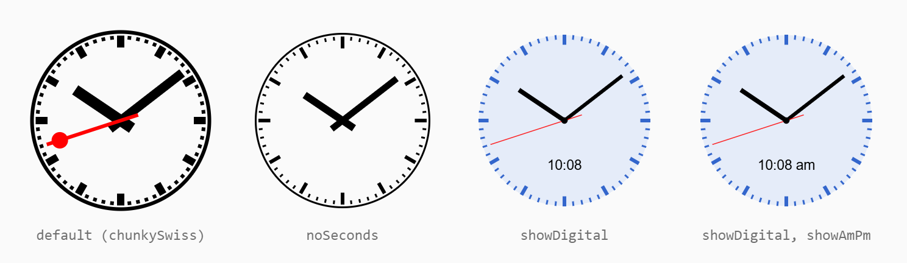

| Einstellung | Attribut | Standard | Beschreibung |
|---|---|---|---|
| Thema | `theme` | classic | Das Design, siehe Bild. Ein unbekannter Name zeigt `chunkySwiss`. |
| Keine Sekunden zeigen | `noSeconds` | aus | Ohne Sekundenzeiger. Die Uhr wird dann alle 15 Sekunden neu gezeichnet. |
| Digitaluhr | `showDigital` | aus | Zeigt die Uhrzeit als Text unter der Mitte, ohne Sekunden. |
| am/pm zeigen | `showAmPm` | aus | Nur mit *Digitaluhr*: 12-Stunden-Format mit `am` / `pm`. |

Einige Designs (`Sand`, `Sun`, `Tumb`, `Stone`, `Disc`) zeichnen über das runde Zifferblatt hinaus und werden am Rand
des Widgets abgeschnitten, wie in vis-1. Standardgröße: 150 x 150 px.

## Klappzahluhr - `tplTwFlipClock`

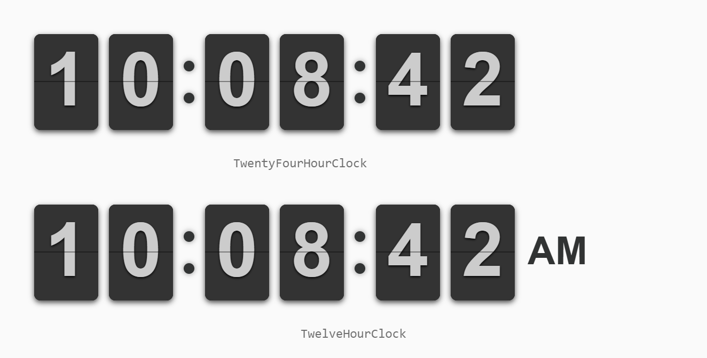

Eine Uhr mit Klappkarten für Stunden, Minuten und Sekunden. Wenn sich eine Ziffer ändert, klappt die obere Hälfte der
Karte herunter.

| Einstellung | Attribut | Standard | Beschreibung |
|---|---|---|---|
| Uhrtyp | `face` | 24 Stunden | `24 Stunden` (`TwentyFourHourClock`) oder `12 Stunden (AM/PM)` (`TwelveHourClock`). Die 12-Stunden-Uhr zeigt 12:00 bis 11:59 und `AM` / `PM` hinter den Sekunden. |

Die Uhr hat eine feste Größe und lässt sich nicht verändern: 500 px breit mit 24 Stunden, 600 px mit 12 Stunden, etwa
110 px hoch. Wie in vis-1 beginnen die Karten 1 em rechts und unterhalb der linken oberen Ecke des Widgets. Die
Farben lassen sich mit [eigenem CSS](#eigenes-css) ändern.

Im dunklen Design von vis-2 werden die Punkte und `AM` / `PM` hell, damit sie auf einer dunklen View sichtbar bleiben:

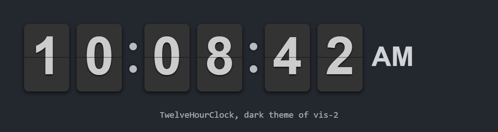

## Wetter (eigene Daten) - `tplTwWeather`

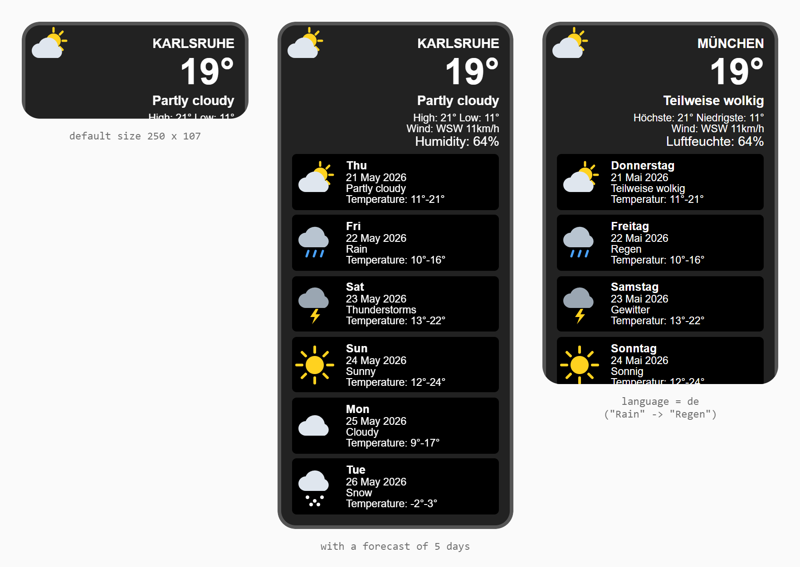

Das aktuelle Wetter und eine Vorhersage für heute und bis zu sechs weitere Tage. Das Widget nimmt seine Werte aus
beliebigen Datenpunkten, zum Beispiel des Adapters *daswetter*, *accuweather* oder *weatherunderground*: Man wählt für
jeden Wert einen Datenpunkt aus.

Die Box zeigt von oben nach unten:

- Stadt, aktuelle Temperatur, Wetterlage
- *Höchste* / *Niedrigste*: Maximum und Minimum von heute
- *Wind*: Richtung und Geschwindigkeit. Eine Richtung in Grad wird als Himmelsrichtung gezeigt (`255` → `WSW`), ein
  Text wie `SW` bleibt, wie er ist.
- *Luftfeuchte* in %
- die Vorhersage: eine Zeile pro Tag mit Wochentag, Datum, Wetterlage und Temperaturen, beginnend mit heute

Das Bild von *Jetzt* ist das Hintergrundbild der Box, die Bilder der Tage stehen links in jeder Zeile. Ohne Bild von
*Jetzt* hat die Box einen Verlauf von Grau nach Dunkel. Das Widget schneidet alles ab, was nicht hineinpasst: In der
Standardgröße von 250 x 107 px ist nur der obere Teil zu sehen, deshalb macht man das Widget so hoch wie die Tage, die
man zeigen will.

**Wetterlagen.** Ist eine Wetterlage einer der bekannten Wetterbegriffe (`Cloudy`, `Rain`, `Wolkig`, `Regen`,
`Облачно`, ...) in irgendeiner Sprache, wird sie in der Sprache des Widgets gezeigt. Jeder andere Text erscheint genau
so, wie der Adapter ihn liefert.

| Einstellung | Attribut | Standard | Beschreibung |
|---|---|---|---|
| Stadt | `city` | | Name über der Temperatur, in Großbuchstaben. |
| Sprache | `language` | wie vis | Sprache der Wochentage, Monate, Beschriftungen und Wetterlagen. |
| Geschwindigkeitseinheit | `units_speed` | `km/h` | Wird an die Windgeschwindigkeit angehängt. |

**Gruppe „Jetzt“** - heute und das aktuelle Wetter:

| Einstellung | Attribut | Beschreibung |
|---|---|---|
| Temperatur-ID | `temperature-0-oid` | Aktuelle Temperatur. |
| Wetterlage-ID | `condition-0-oid` | Aktuelle Wetterlage als Text. |
| Luftfeuchtigkeit-ID | `humidity-0-oid` | Luftfeuchtigkeit in %. |
| Min. Temperatur-ID / Max. Temperatur-ID | `temperature-min-0-oid` / `temperature-max-0-oid` | Minimum und Maximum von heute. |
| Windgeschwindigkeit-ID | `wind-speed-0-oid` | Windgeschwindigkeit. Ohne sie gibt es keine Windzeile. |
| Windrichtung-ID | `wind-dir-0-oid` | Richtung in Grad (0 = Nord) oder als Text. |
| Bild-URL-ID | `icon-0-oid` | Ein Datenpunkt mit der URL eines Bildes. |

**Gruppen „Morgen“, „Übermorgen“, „In 3 Tagen“ ... „In 6 Tagen“** - die Vorhersage, die Attributnamen enthalten die
Nummer des Tages (`1` = morgen ... `6`):

| Einstellung | Attribut | Beschreibung |
|---|---|---|
| Wetterlage-ID | `condition-1-oid` | Wetterlage des Tages. |
| Min. Temperatur-ID / Max. Temperatur-ID | `temperature-min-1-oid` / `temperature-max-1-oid` | Temperaturen des Tages. |
| Bild-URL-ID | `icon-1-oid` | URL des Bildes für den Tag. |

Die Vorhersage endet beim ersten Tag, der weder Temperaturen noch eine Wetterlage hat. Zeilen für Werte, die nicht
gesetzt sind, entfallen. Statt einer Objekt-ID nimmt jedes Feld auch ein Binding wie `{weather.0.current.temp}`.

## SVG-Uhr - `tplSvgClock`

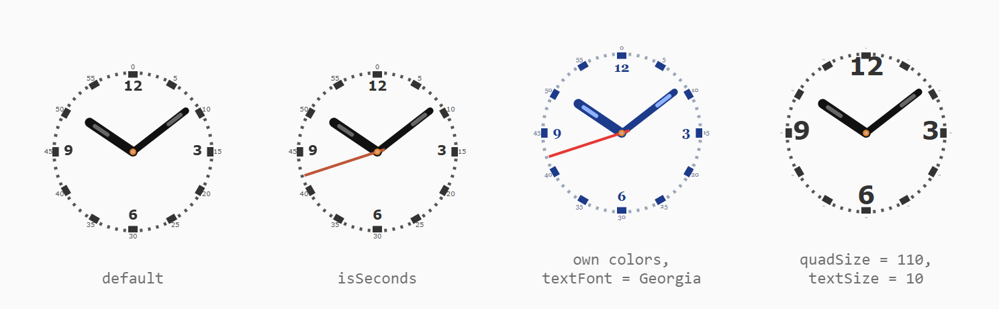

Eine Analoguhr als SVG. Sie lässt sich beliebig skalieren, die Linien behalten ihre Breite in Pixeln. Der Editor
hält das Widget quadratisch.

| Einstellung | Attribut | Standard | Beschreibung |
|---|---|---|---|
| Viertel-Textgröße | `quadSize` | 60 | Größe der Zahlen 12, 3, 6 und 9, bezogen auf eine Uhr von 900 Einheiten. |
| Viertel-Textfarbe | `quadColor` | `#333` | Farbe dieser Zahlen. |
| Viertel-Strichfarbe | `quadTickColor` | `#333` | Farbe der Striche an jeder fünften Minute. |
| Minuten-Textgröße | `textSize` | 30 | Größe der Minutenzahlen 0, 5, 10, ... außerhalb des Rings. |
| Minuten-Textfarbe | `textColor` | `#555` | Farbe der Minutenzahlen. |
| Farbe der kleinen Striche | `tickColor` | `#555` | Farbe der übrigen Striche. |
| Sekundenzeiger zeigen | `isSeconds` | aus | Zeigt den Sekundenzeiger. |
| Zeigerfarbe | `handsColor` | `#111` | Farbe von Stunden- und Minutenzeiger. |
| Farbe der Zeigerlinie | `handsColorLine` | `#666` | Farbe der Linie in den Zeigern. |
| Sekundenzeigerfarbe | `handsSecColor` | `#be5639` | Nur mit *Sekundenzeiger zeigen*. |
| Schriftart | `textFont` | Verdana | Schrift aller Zahlen. |

Standardgröße: 100 x 100 px.

## Segmentanzeige - `tplSegmentClock`

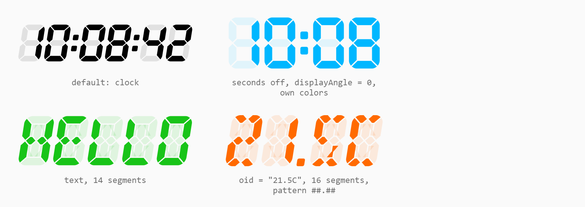

Eine Anzeige mit 7, 14 oder 16 Segmenten pro Zeichen, wie bei einem Radiowecker. Sie zeigt in dieser Reihenfolge:

1. den Wert der *Objekt-ID*, falls gesetzt,
2. sonst den *Text*, falls gesetzt,
3. sonst die Uhrzeit, falls *Uhr aktivieren* an ist,
4. sonst `no oid, no text, no clock`.

Die Anzeige wird auf die Größe des Widgets skaliert und behält dabei ihre Proportionen: *Zeichenhöhe*,
*Zeichenbreite* und die anderen Maße sind Verhältnisse, keine Pixel. Buchstaben werden gezeigt, soweit die Segmente
es erlauben; 7 Segmente kennen nur Ziffern und wenige Buchstaben, 16 Segmente fast alle. Groß- und Kleinschreibung
sehen gleich aus.

**Gruppe „Allgemein“**

| Einstellung | Attribut | Standard | Beschreibung |
|---|---|---|---|
| Objekt-ID | `oid` | | Ein Datenpunkt, dessen Wert gezeigt wird. |
| Text | `text` | | Ein fester Text. Nur ohne *Objekt-ID*. |

**Gruppe „Uhr“**

| Einstellung | Attribut | Standard | Beschreibung |
|---|---|---|---|
| Uhr aktivieren | `clock` | an | Zeigt die Uhrzeit, wenn weder *Objekt-ID* noch *Text* gesetzt sind. |
| Sekunden zeigen | `seconds` | an | `hh:mm:ss` statt `hh:mm`. Ist es aus und die Vorlage die Standardvorlage `##:##:##`, verwendet das Widget `##:##` - auch für einen Wert oder einen Text. |

**Gruppe „Stil“**

| Einstellung | Attribut | Standard | Beschreibung |
|---|---|---|---|
| Vorlage | `pattern` | `##:##:##` | Ein `#` pro Zeichen. `.` und `:` sind schmale Plätze für einen Punkt oder Doppelpunkt, ein Leerzeichen ist eine Lücke. Jeder Platz nimmt ein Zeichen des Werts, ein Wert `21.5` braucht also die Vorlage `##.#`. Andere Zeichen lassen die Anzeige leer. |
| Segmentfarbe AN / AUS | `colorOn` / `colorOff` | schwarz / 10 % schwarz | Farben der leuchtenden und der dunklen Segmente. |
| Intervall für Lauftext (ms) | `runStepInterval` | 0 | Für einen Wert oder Text: Schiebt den Text alle so viele Millisekunden um ein Zeichen nach links und lässt ihn von rechts wieder hereinlaufen. 0: kein Lauftext. |
| Anzahl der Segmente | `segmentCount` | 7 | 7, 14 oder 16 Segmente pro Zeichen. |
| Neigungswinkel | `displayAngle` | 9 | Schräglage der Zeichen in Grad. |
| Zeichenhöhe / Zeichenbreite | `digitHeight` / `digitWidth` | 20 / 12 | Proportionen eines Zeichens. |
| Zeichenabstand | `digitDistance` | 2 | Abstand zwischen den Zeichen. |
| Segmentbreite | `segmentWidth` | 3 | Dicke der Segmente. |
| Segmentabstand | `segmentDistance` | 0.5 | Lücke zwischen den Segmenten. |
| Ecktyp | `cornerType` | spitz | Form der Segmentenden, siehe unten. |

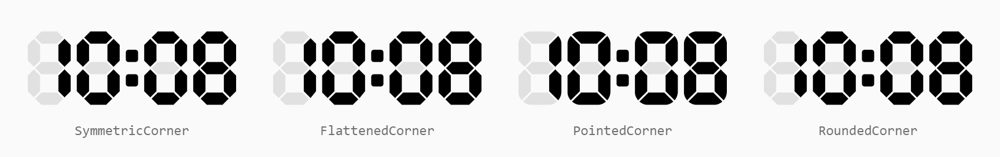

Die Namen der Ecktypen stammen aus vis-1 und passen nicht ganz zu dem, was sie zeichnen: *spitz* ergibt abgerundete
Enden, und *gerundet* sieht aus wie *symmetrisch*. Sie wurden beibehalten, damit bestehende Projekte gleich aussehen.

Standardgröße: 100 x 30 px.

## Unterschiede zu vis-1

Die vis-2-Widgets verwenden kein jQuery und keine der Bibliotheken von vis-1 (CoolClock, FlipClock.js, zWeatherFeed,
segment-display.js). Das Zeichnen der Cool-Uhr und der Segmentanzeige wurde unverändert übernommen. Projekte
funktionieren ohne Änderungen weiter. Einige Details funktionieren anders:

- **Sprachen:** Wochentage, Monate und die Wetterwörter gibt es in allen Sprachen von vis-2. vis-1 kannte nur
  Englisch, Deutsch und Russisch und zeigte für andere Sprachen `undefined`.
- **Wetterlagen:** Übersetzt werden nur exakte Wetterbegriffe. vis-1 nahm auch Begriffe, die den Text nur enthielten,
  und zeigte `Rain` als *Regen mit Schnee* und eine leere Wetterlage als *Tornado*.
- **Wetter:** Werte, die nicht gesetzt sind, hinterlassen keine leeren Zeilen wie `Höchste: ° Niedrigste: °` mehr. Die
  Yahoo!-Bilder, die vis-1 bei fehlendem Bild verwendete, gibt es nicht mehr, ebenso wenig wie den Dienst.
- **Wetter:** Die Gruppen der Vorhersagetage sind richtig benannt. In vis-1 hieß der Tag in drei Tagen *In 2 Tagen*.
- **Einfaches Datum:** Die englischen Ordnungszahlen stimmen für den 21st, 22nd, 23rd und 31st, auch mit führender
  Null.
- **SVG-Uhr:** Mehrere Uhren auf einer View können verschiedene Strichfarben haben. In vis-1 übernahmen alle die
  Farben der ersten.
- **Cool-Uhr und Segmentanzeige:** scharf auf hochauflösenden Bildschirmen.
- Die Widgets **HtcWeather** und **YahooWeather** von vis-1 gibt es nicht, da der Yahoo!-Wetterdienst, den sie
  brauchten, abgeschaltet wurde. Stattdessen *Wetter (eigene Daten)* mit den Datenpunkten eines Wetter-Adapters
  verwenden.
